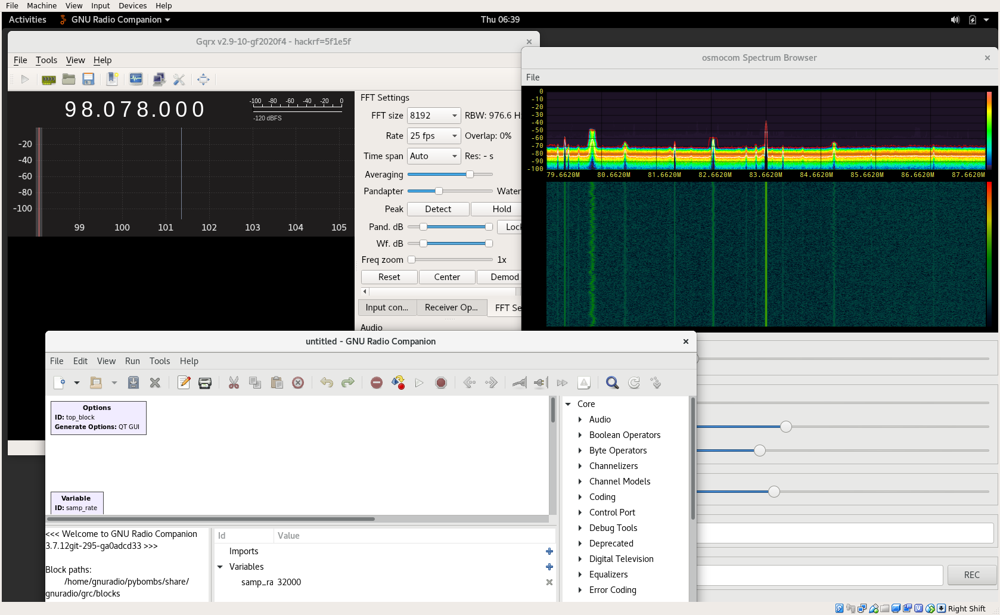
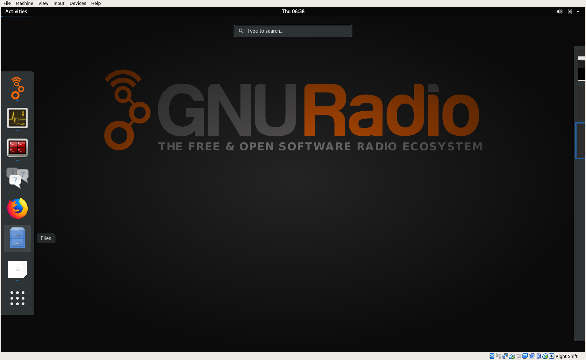
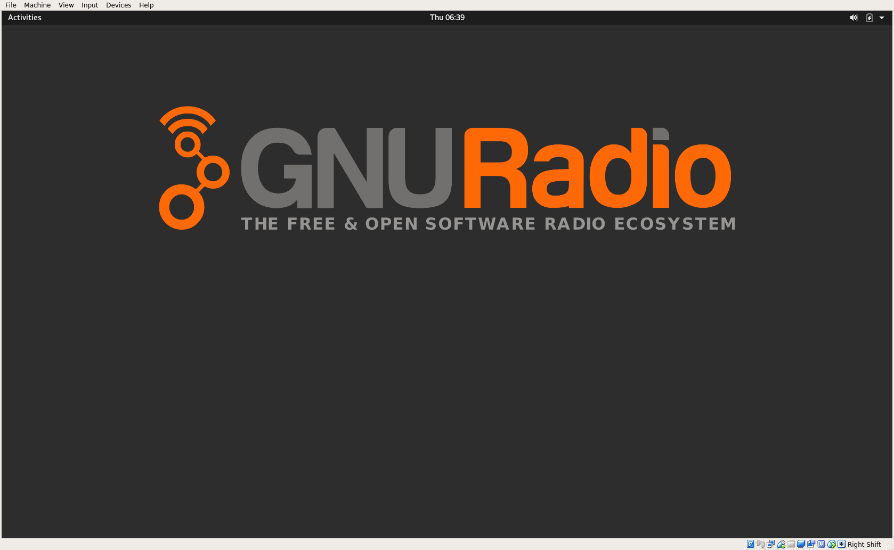
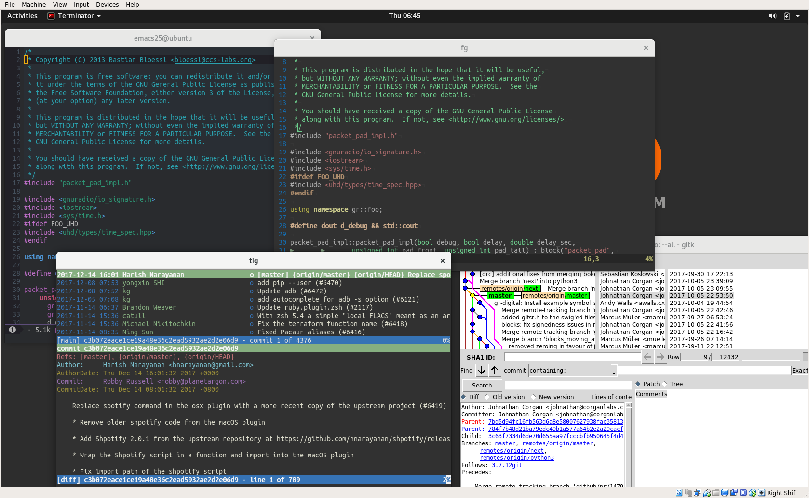

# Instant GNU Radio

A customizable, programmatically generated VM and live environment for GNU Radio.



## Main Features

- OVA VM appliance can be imported in all main virtualization solutions or `dd`ed on a USB drive.
- Based on Ubuntu 17.10 w/ GNOME 3.
- Two step build process: first create a base image, then extend it with SDR stuff.
- Easy to brand for your own courses/workshops. Just replace the wallpaper in the `assets` folder, for example.
- Software: GNU Radio, GQRX, gr-ieee-***, ...
- Fosphor support!
- Hardware: HackRF, RTL-SDR, UHD; properly setup with udev rules and downloaded images.
- Productivity: Git, Meld, VIM, Spacemacs, ...
- Favorite applications (in the sidebar) are set to GNU Radio Companion, GQRX, GNU Radio Wiki, ...
- Sane VM defaults (USB, 3D acceleration, audio, shared clipboard, etc.).
- Ready for offline use.
- CPU governors are set to *performance*.
- No annoying crash reports dialogs.
- No screen blanking.
- No `sudo` password.

## Credentials

``` bash
user: gnuradio
password: gnuradio
```

### SSH Login

``` bash
ssh -p2222 gnuradio@localhost
```

Password is `gnuradio`.

You might want to add something like this to your SSH config (`~/.ssh/config`):

``` bash
Host vm
	Hostname localhost
	User gnuradio
	Port 2222
	UserKnownHostsFile /dev/null
	StrictHostKeyChecking no
```

With this config, you can login with `ssh vm` and your password.


## Customization

If you want to rebuild and customize the environment, read on...

```bash
sudo apt install packer
sudo apt install virtualbox virtualbox-ext-pack
```

On Ubuntu, your user should be in the `vboxusers` group.

``` bash
sudo usermod -a -G vboxusers <your username>
```

You have to logout and login again for the changes to take effect.

GitHub doesn't allow uploading files over 100Mb and, therefore, prevents adding the OpenCL runtime to the repo.
Please download the runtime and put it into the `assets` folder.

http://registrationcenter-download.intel.com/akdlm/irc_nas/12513/opencl_runtime_16.1.2_x64_rh_6.4.0.37.tgz


## Create Image

You have to be online to build the image.
Then, just run:

``` bash
packer build instant-gnuradio-base.json
packer build instant-gnuradio.json
```

## Live Image

TBD. See the `gen_iso.sh` and `chroot.sh` script.

## More Screenshots



